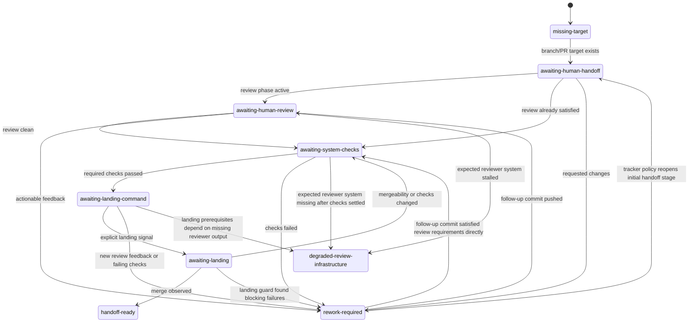

# Architecture

`symphony-ts` should track the Symphony spec closely enough that the spec remains the primary architecture reference.

## Layer Stack

```text
CLI
  -> Workflow / Config
  -> Tracker
  -> Workspace
  -> Runner
  -> Orchestrator
  -> Observability
```

This ordering is logical, not an excuse for tight coupling. Each layer should expose a narrow service contract.

## Spec Abstraction Levels

`SPEC.md` describes Symphony in these abstraction levels:

1. Policy Layer
2. Configuration Layer
3. Coordination Layer
4. Execution Layer
5. Integration Layer
6. Observability Layer

In `symphony-ts`, use this local mapping when `SPEC.md` is not present in the clone:

- Policy Layer: `WORKFLOW.md`, issue plans, and repository-owned guidance
- Configuration Layer: workflow loading, parsing, and typed config resolution under `src/config/`
- Coordination Layer: orchestrator polling, retries, reconciliation, and runtime state under `src/orchestrator/`
- Execution Layer: workspace lifecycle plus runner process control under `src/workspace/` and `src/runner/`
- Integration Layer: tracker adapters, transport, and normalization under `src/tracker/`
- Observability Layer: structured logs and operator-facing status surfaces under `src/observability/`

The CLI is bootstrap wiring around these layers, not a replacement for them.

## Core Layers

### CLI

Responsible for:

- process startup
- environment/bootstrap wiring
- loading the runtime
- graceful shutdown handling

The CLI should stay thin.

### Workflow / Config

Responsible for:

- locating `WORKFLOW.md`
- parsing front matter and prompt body
- rendering prompt templates
- resolving typed runtime settings

This layer defines the repository-owned runtime contract.

### Tracker

Responsible for:

- reading eligible work
- claiming and releasing work
- refreshing current issue state
- completing or handing off work according to tracker policy

Tracker implementations must normalize external data into a stable internal issue model.

### Workspace

Responsible for:

- deterministic workspace paths
- workspace creation and reuse
- execution-target metadata for prepared workspaces
- lifecycle hooks such as `after_create`
- cleanup policy

This layer owns execution-workspace preparation, not tracker policy. Today that
means local filesystem checkouts; future remote targets should extend this
contract without pushing host/path logic up into runners or the orchestrator.

### Runner

Responsible for:

- launching coding agents
- reporting provider identity, execution transport, and final results through a stable execution contract
- timeout and cancellation behavior

The runner should not own prompt construction or tracker mutations. Codex is the
current local adapter behind that contract, not a shape the orchestrator should
depend on. Local subprocess facts such as a controllable `pid` belong in
transport metadata, not as universal runner-session state.

### Orchestrator

Responsible for:

- polling
- concurrency limits
- runtime state
- dispatch decisions
- retries
- reconciliation
- shutdown behavior

This is the control plane of the application.

### Observability

Responsible for:

- structured logs
- operation boundaries / spans
- operator-facing runtime context

Keep this layer thin and composable.

## Domain Shape

The internal runtime should converge on a small set of normalized concepts:

- `Issue`
- `WorkflowDefinition`
- `ResolvedConfig`
- `WorkspaceInfo`
- `RunAttempt`
- `RunnerEvent`
- `RunResult`
- `RetryEntry`
- `OrchestratorState`

Adapters can hold extra data internally, but the orchestrator should consume stable internal types.

## Handoff Lifecycle

One work item also carries a normalized handoff lifecycle that abstracts over
tracker-specific review and landing mechanics. The lifecycle kind is defined in
`src/domain/handoff.ts` and is intentionally richer than a tracker's native
issue status. GitHub and Linear adapters normalize their own signals into this
shared shape so the orchestrator can make decisions without embedding
tracker-specific policy branches.



This lifecycle is not the same thing as queue ownership. Queue membership such
as `ready`, `running`, and `failed` still lives at the tracker edge. The
handoff lifecycle is the orchestrator-facing interpretation of "where this work
currently sits" once Symphony inspects the branch, PR, checks, and review
signals.

## Dependency Rules

1. The orchestrator depends on service interfaces, not concrete adapters.
2. Trackers do not reach upward into orchestrator logic.
3. Runners do not render prompts or manipulate tracker state.
4. Workspaces do not decide dispatch policy.
5. Observability should be injectable across the system.
6. Tests may wire layers however they need, but production code should respect the service boundaries.

## Phase Guidance

### Phase 0

Build the minimum real loop:

- bootstrap GitHub tracker
- local workspace
- local runner
- single-process orchestrator

### Phase 1

Stabilize runtime contracts:

- normalize domain types
- tighten service interfaces
- make orchestrator state explicit

### Phase 2 and beyond

Extend at the edges first:

- Beads adapter
- runner variations
- Context Library hooks
- remote execution

Do not let future integrations distort the core runtime before they have earned that complexity.

## Decision Records

Architectural decisions that need durable justification should be recorded in `docs/adrs/`.
